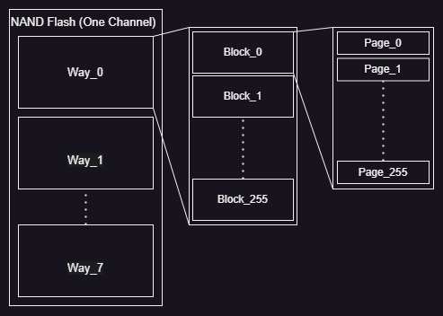

# Verilog-Project-NMC
Verilog-Project-NMC for NCKU CAID Lab

# Environment
  >[!IMPORTANT]  
  >  Vivado: 2019.1  
  >  SDK:    2019.1 

  IP Location:  
    1. Watershed version:   
    2. 8 channels version 

# Wrapper Command Flow #
  3 steps: Trigger, Check, & Transfer
  
  Way : 8 bits

  ## 0. Information ##
  Before watching the below information, you first know the flow for transfer data  
  1. Top view  
  
  2. Flow

  ## 1. Trigger ##

  | Command | Physical address  | Data    |
  | :----:  | :----:            | :----:  |
  | Opcode  | 0x43Cx_4000       | 32'h1C4 |
  | Way     | 0x43Cx_4004       |Flash_Way|
  |Row Addr | 0x43Cx_4008       |B*256+P  |
  | -       | -                 | -       |
  |Ready    | 0x43Cx_3000       | 32'd1   |

  * ### Note: ### 
    1. Flash_Way: Unary type
    2. B: Block
    3. P: Page

  * ### NAND Flash Operation Information ### 
    Need to attention that "Nand Flash Control" receive the "Trigger Command",
    The next command signal cannot transfer to "t4c_hlper_x" because the page data are transmitted
    from "NAND Flash Physical page" to "NAND Flash Controller page buffer". 
  > [!TIP]  
  >  The "busy signal" in diff. place have indevidual name:     
  >  Q: This part have some problem about the real Busy signal is for what?  
  >  A: Now I think so represent which way is trigger and want to read from. 
  >  * NAND Flash Controller(v2nfc_x) : port (oReadyBusy[7:0])
  >  * Helper (t4nfc_hlper_x) : port (iReadyBusy[7:0])
  >  * Unet/Accelerator Wrapper :  
  

  ## 2. Check ##

  | Command | Physical address  | Data    |
  | ----    | ----              | ----    |
  | Opcode  | 0x43Cx_4000       | 32'h130 |
  | Way     | 0x43Cx_4004       |Flash_Way|
  | Status Report Address|0x43Cx_4008 | (1)|
  |Clear Status Report| (1)     | 32'h0   |
  |-        |-                  |-        |
  |Ready    | 0x43Cx_3000       | 32'h1   |

  ## 3. Transfer ##
  
  | Command | Physical address  | Data    |
  | :----:  | :----:            | :----:  |
  | Opcode  | 0x43Cx_4000       | 32'h338 |
  | Way     | 0x43Cx_4004       |Flash_Way|
  |Row Addr | 0x43Cx_4008       |B*256+P  |
  | -       | -                 | -       |
  |Ready    | 0x43Cx_3000       | 32'd1   |

  ### Report Information ###
  > [!IMPORTANT]  
  >  Q: What is "___ Report Address" & "___ Report " in the command?  
  >  A: Address that you can discuss with firmware & change the place. 
  >  * Report Address is for NFC to store the information in the specific place.  
  >  * Report is the real information for checking whether NFC can execute normally. 

  >[!info] 
  > ### Status Report (1) ###
  > 
  > ### Error Info (2)
  > ### Completion Report (3) ###
  
  ## Appendix
  For now the report address ref. Base
  
  | Command | Physical address  | Data    |
  | ----    | ----              | ----    |
  | Opcode  | 0x43Cx_4000       | 32'h130 |
  | Way     | 0x43Cx_4004       |Flash_Way|
  | Status Report Address|0x43Cx_4008 | (1)|
  |||
  |Ready||1