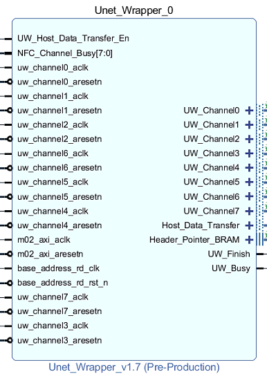

# IP Information #
## Unet Wrapper (Watershed) ###
This part's parameters can refer the below part.

## Unet Wrapper (8 Channels) ###
### 1. IP GUI 
This IP has four crucial parts:  
1. Mapping Table Header:  

2. Transfer command part:    
3. I/O signal:  
4. Host data Transfer part: 

### 2. How to revise
