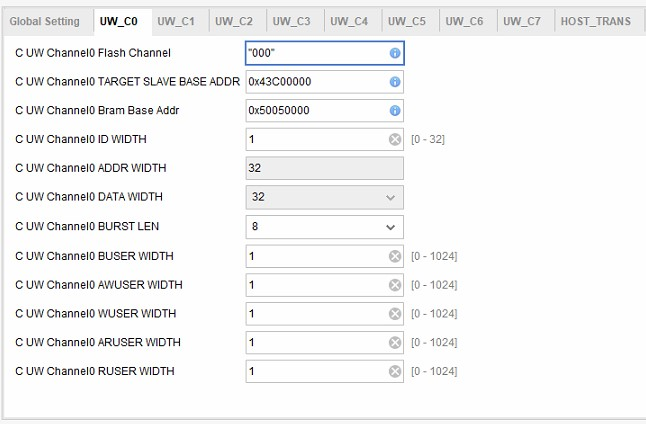
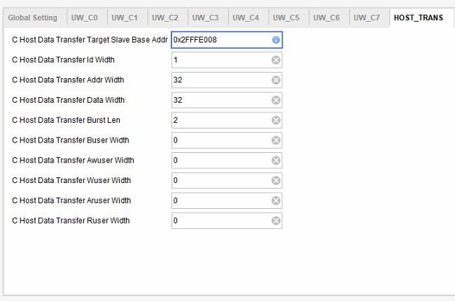

# IP Information #
## Unet Wrapper (Watershed) ###
This part's parameters can refer the below part.

## Unet Wrapper (8 Channels) ###
### 1. IP GUI 
This IP has four crucial parts:  
1. Mapping Table Header:  
    * Header_Pointer_BRAM (BRAM Protocal):
2. Transfer command port:  
    * UW_channel0~7 (AXI Protocal):
3. I/O signal:  
    * UW_Finish:  
    This signal notice other sub-module that Wrapper is operating.    
    * UW_Busy:  
    This signal notice other sub-module that Wrapper is operating.
    * UW_Host_Data_Transfer_En:  
    This signal is from Unet Accelator or Watershed.
4. Host data Transfer part:  
    * Host_Data_Transfer (AXI Protocal):

      

### 2. IP Parameter Setting  
*   Unet Wrapper Channel0~7
     
    1. __Flash Channel:__   
    Setting the value "c" in each sub-module is which channel
    2. __Target slave base addr (0x43Cx_0000):__    
    Setting where the command start (for helper).  
    "x" is for diff. channel base address.   
    For instance:  
    Channel 0 -> 0x43C0_0000  
    Channel 4 -> 0x43C4_0000  
    etc.
    3. __Bram base addr:__

*   Unet Wrapper Host Data Transfer
     
   1. 
   2. __Others:__ 

### How to revise

### IP Revise Method ###

* Add New Modules
* Merge the File
* Parameter Adjustment 
* Re-Package IP

